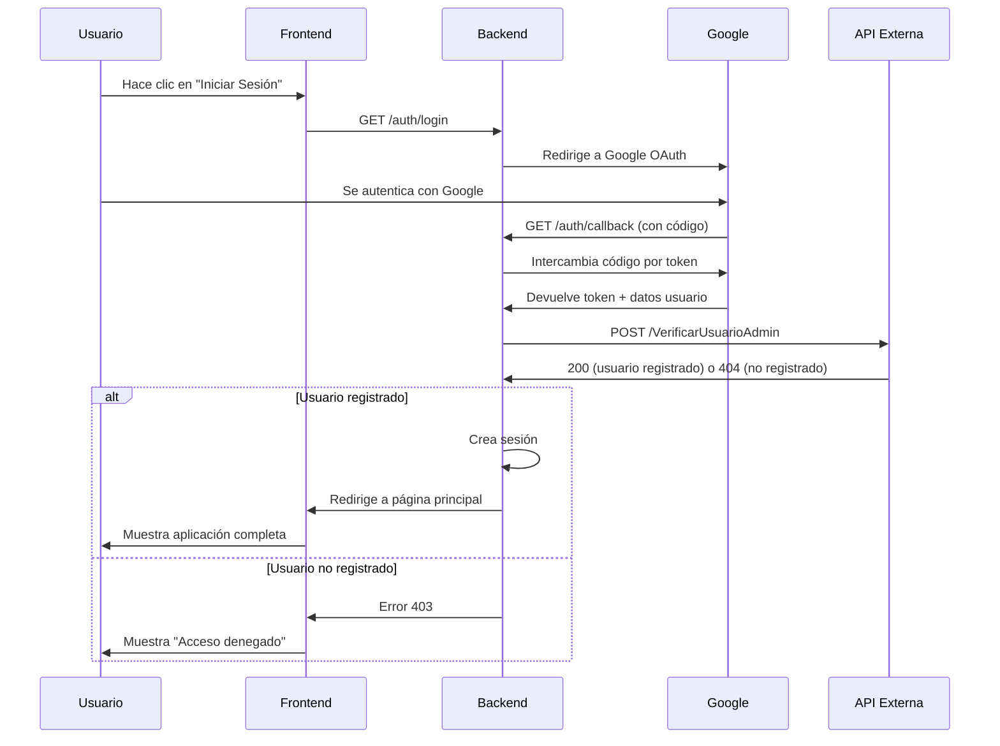

# Resumen de Implementación - Sistema de Autenticación

## ✅ Funcionalidades Implementadas

### 1. Autenticación con Google OAuth
- **Archivo**: `auth.py`
- **Funcionalidad**: Integración completa con Google OAuth 2.0
- **Características**:
  - Login con cuenta de Google
  - Manejo de tokens OAuth
  - Verificación de usuarios con API externa
  - Gestión de sesiones seguras

### 2. Verificación de Usuarios Registrados
- **Endpoint**: `/internalapi/VerificarUsuarioAdmin`
- **Funcionalidad**: Verificación automática contra API externa
- **Proceso**:
  1. Usuario se autentica con Google
  2. Sistema obtiene email del usuario
  3. Llama a la API externa para verificar registro
  4. Si está registrado (200): permite acceso
  5. Si no está registrado (404): deniega acceso

### 3. Middleware de Autorización
- **Decorador**: `@login_required`
- **Rutas protegidas**: Todas las rutas de la API
- **Funcionalidad**: Verificación automática de autenticación

### 4. Frontend con Gestión de Autenticación
- **Archivos**: `templates/index.html`, `static/app.js`
- **Características**:
  - Botones de login/logout
  - Información del usuario autenticado
  - Modal de autenticación requerida
  - Deshabilitación de funcionalidades sin autenticación

## 🔧 Archivos Modificados/Creados

### Nuevos Archivos
1. **`auth.py`** - Módulo completo de autenticación
2. **`CONFIGURACION_AUTENTICACION.md`** - Documentación de configuración
3. **`IMPLEMENTACION_AUTENTICACION_RESUMEN.md`** - Este resumen

### Archivos Modificados
1. **`requirements.txt`** - Agregadas dependencias OAuth
2. **`config.py`** - Configuraciones de autenticación
3. **`app.py`** - Integración de autenticación y protección de rutas
4. **`templates/index.html`** - Interfaz de usuario con autenticación
5. **`static/app.js`** - Lógica de autenticación en frontend

## 🛡️ Rutas Protegidas

Todas las siguientes rutas ahora requieren autenticación:

### API de Sucursales
- `GET /api/sucursales` - Obtener sucursales
- `POST /api/sucursales` - Crear sucursal

### API de Zonas de Cobertura
- `GET /api/zonas` - Obtener zonas
- `GET /api/zonas/<id>` - Obtener zonas por sucursal
- `POST /api/zonas` - Crear zona
- `POST /api/guardar-zona` - Guardar zona en API externa
- `DELETE /api/eliminar-zona` - Eliminar zona

### API de Utilidades
- `POST /api/geocodificar` - Geocodificar dirección
- `POST /api/consultar-cobertura` - Consultar cobertura

## 🔐 Rutas de Autenticación

### Nuevas Rutas
- `GET /auth/login` - Iniciar proceso de login con Google
- `GET /auth/callback` - Callback de Google OAuth
- `GET /auth/logout` - Cerrar sesión
- `GET /auth/status` - Estado de autenticación

## 📋 Variables de Entorno Requeridas

```env
# Google OAuth
GOOGLE_CLIENT_ID=tu-client-id.googleusercontent.com
GOOGLE_CLIENT_SECRET=tu-client-secret
GOOGLE_REDIRECT_URI=http://localhost:5000/auth/callback

# Sesión
SECRET_KEY=tu-clave-secreta
PERMANENT_SESSION_LIFETIME=3600

# API Externa (ya existía)
EXTERNAL_API_BASE_URL=http://localhost:5064
EXTERNAL_API_TOKEN=tu-token
```

## 🔄 Flujo de Autenticación



## 🚀 Cómo Usar

### 1. Configurar Variables de Entorno
Crear archivo `.env` con las credenciales de Google OAuth (ver `CONFIGURACION_AUTENTICACION.md`)

### 2. Instalar Dependencias
```bash
pip install -r requirements.txt
```

### 3. Ejecutar Aplicación
```bash
python app.py
```

### 4. Acceder a la Aplicación
1. Ir a `http://localhost:5000`
2. Hacer clic en "Iniciar Sesión"
3. Autenticarse con Google
4. Si el usuario está registrado en la API externa, accederá a la aplicación completa

## 🔍 Características de Seguridad

1. **Verificación de Usuarios**: Solo usuarios registrados en la API externa pueden acceder
2. **Sesiones Seguras**: Uso de Flask sessions con SECRET_KEY
3. **Tokens OAuth**: Manejo seguro de tokens de Google
4. **HTTPS Requerido**: En producción (Google OAuth requirement)
5. **Rate Limiting**: Integrado con el sistema existente
6. **CORS**: Configurado para permitir autenticación

## 📝 Notas Importantes

1. **API Externa**: Debe tener el endpoint `/internalapi/VerificarUsuarioAdmin` funcionando
2. **Google Console**: Debe configurarse con las URLs correctas de la aplicación
3. **Producción**: Requiere HTTPS y configuración de dominio real
4. **Usuarios**: Solo usuarios con email registrado en la API externa pueden acceder
5. **Sesiones**: Se mantienen por 1 hora por defecto (configurable)

## 🐛 Troubleshooting Común

1. **"redirect_uri_mismatch"**: Verificar URLs en Google Console
2. **"Usuario no autorizado"**: Verificar que el usuario esté en la API externa
3. **"Sesión expirada"**: Verificar SECRET_KEY y configuración de sesión
4. **"Error de conexión"**: Verificar que la API externa esté funcionando

## ✅ Estado del Proyecto

- ✅ Autenticación Google OAuth implementada
- ✅ Verificación de usuarios con API externa implementada
- ✅ Protección de todas las rutas de API implementada
- ✅ Frontend actualizado con gestión de autenticación
- ✅ Documentación completa creada
- ✅ Sistema listo para uso en desarrollo
- 🔄 Pendiente: Configuración para producción (HTTPS, dominio real)
